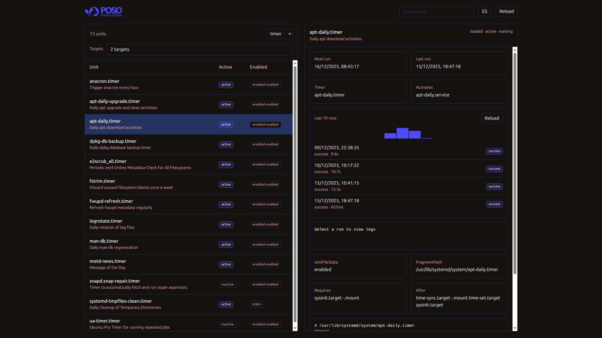

# systemd-ui

Minimal web UI to inspect local systemd units, schedules, run history, and logs.




## Run

```bash
python3 server.py
```

Open `http://127.0.0.1:5173`.

## Notes

- Requires access to `systemctl` and `journalctl`.
- Run history is derived from journald via `INVOCATION_ID` and is limited by journal retention.
